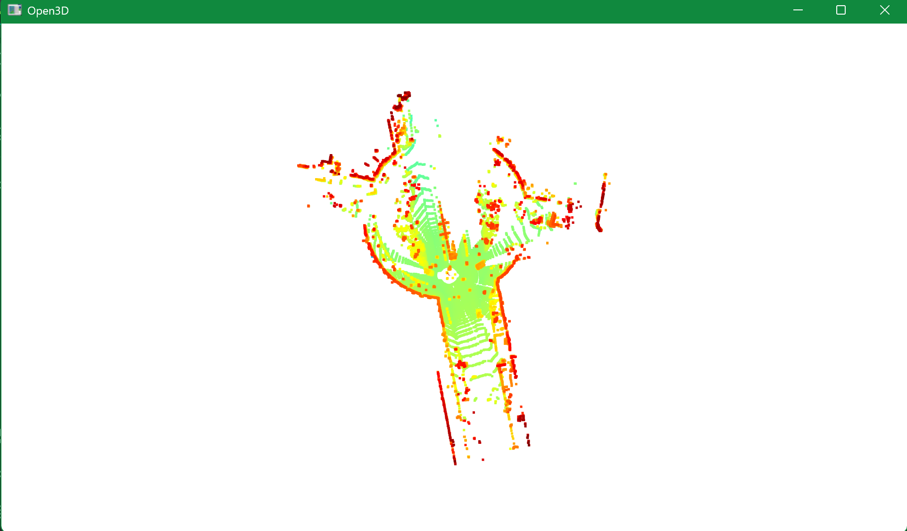

# Try-open3d  
Data set https://www.cvlibs.net/datasets/kitti/

## Ref
- [Start of investigation "VoteNet"](https://www.chowagiken.co.jp/blog/3d_pointclouddata_object_detection)
- [Try use data set "kitti"](https://www.cvlibs.net/datasets/kitti/eval_tracking.php)
- [Download Velodyne point clouds, if you want to use laser information (35 GB)](https://s3.eu-central-1.amazonaws.com/avg-kitti/data_tracking_velodyne.zip)→time series of Lidar
 
## 対象Folder
  - training
  - testing
  - velodyne
